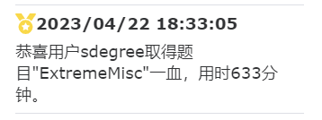

## I am Sdegree
### Nice to meet you
A CTFer and trainee Redteam members
 
Mainly researching Web security and Misc direction
### **My Team:**
<a href="https://v3.cn.vuejs.org"><code></code></a><[HnuSec](http://47.107.252.179:6371/home/honor)>：My School Team
 
<a href="https://reactjs.org/"><code></code></a><[N0wayBack-SEC](https://n0wayback.com/index.html)>：University Joint Team

### **My Website：**

 <[Sdegreeの小站](https://sdegree.cn/)>
### **技术栈:**

<a href="https://v3.cn.vuejs.org"><code></code></a>
<a href="https://reactjs.org/"><code></code></a>
<a href="https://nextjs.org/"><code></code></a>
<a href="https://www.tslang.cn/index.html"><code></code></a>
<a href="https://webpack.js.org/"><code></code></a>
<a href="https://cn.vitejs.dev"><code></code></a>
<a href="https://sass-lang.com"><code></code></a>
<a href="https://tailwindcss.com"><code></code></a>
<a href="https://go.dev/"><code></code></a>
<a href="https://www.docker.com"><code></code></a>

### Fist Blood Memorial

### Github Activation

